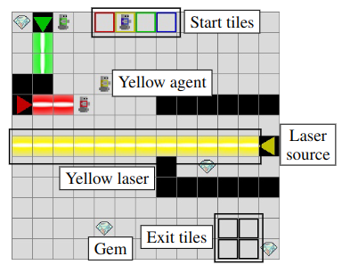

# Laser Learning Environment (LLE)
LLE is a fast Multi-Agent Reinforcement Learning environment written in Rust which has proven to be a difficult exploration benchmark so far.



## Overview
The agents start in the start tiles, must collect the gems and finish the game by reaching the exit tiles. There are five actions: North, South, East, West and Stay. 

When an agent enters a laser of its own colour, it blocks it. Otherwise, it dies and the game ends.

## Citing our work
The paper has been presented at EWRL 2023.
[https://openreview.net/pdf?id=IPfdjr4rIs](https://openreview.net/pdf?id=IPfdjr4rIs)


```
@inproceedings{molinghen2023lle,
  title={Laser Learning Environment: A new environment for coordination-critical multi-agent tasks},
  author={Molinghen, Yannick and Avalos, Raphaël and Van Achter, Mark and Nowé, Ann and Lenaerts, Tom},
  year={2023},
  series={European Workshop on Reinforcement Learning},
  booktitle={EWRL 2023}
}
```


## Usage
### Low level control
The `World` class is the low-level object that you can work with. 

```python
from lle import World, Action
world = World("S0 G X") # Linear world with start S0, gem G and exit X
world.reset()
available_actions = world.available_actions[0] # Action.STAY, Action.EAST
reward = world.step([Action.EAST])
reward = world.step([Action.EAST])
assert world.done
```

You can also access and force the state of the world
```python
state = world.get_state()
...
world.set_state(state)
```

You can query the world on the tiles with `world.start_pos`, `world.exit_pos`, `world.gem_pos`, ...

### High-Level control
You can also use LLE as an `RLEnv` with the `lle.LLE` class. This class is a wrapper around the `World` class that implements the `RLEnv` interface. 


```python
from lle import LLE
env = LLE.from_str("S0 G X")
obs = env.reset()
obs, reward, done, info = env.step([0]) # Actions are now integers
```
## Building
This project has been set up using [Poetry](https://python-poetry.org/). To build the project, run the following commands:
```bash
poetry shell
poetry install
maturin develop  # For development
maturin build    # For distribution
```

## Tests
This project **does not** respect Rust unit tests convention and takes inspiration from [this structure](http://xion.io/post/code/rust-unit-test-placement.html). Unit tests are in the `src/unit_tests` folder and are explicitely linked to in each file with the `#path` directive. 
Integration tests are written on the python side.

Run unit tests with 
```bash
cargo test
```

Run integration tests with
```bash
maturin develop
pytest
```
